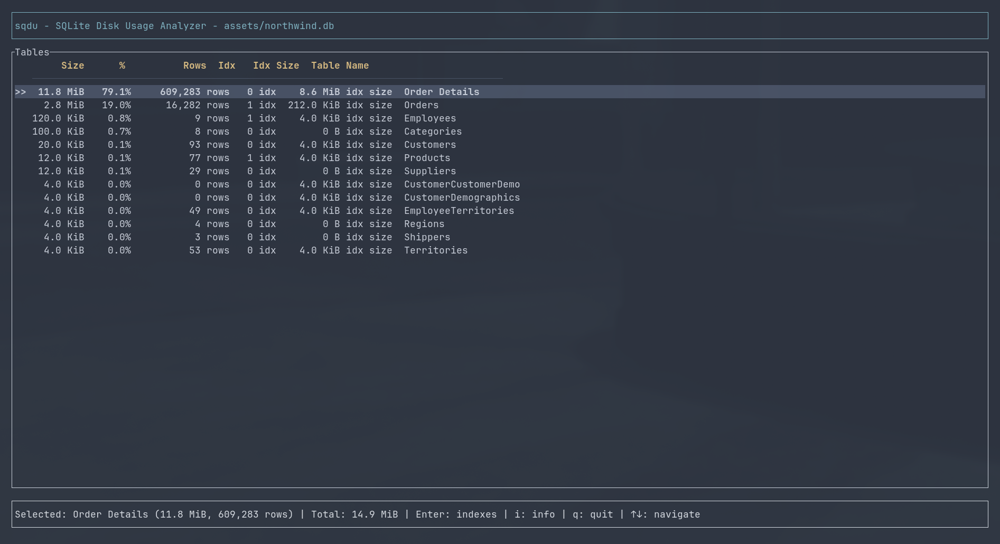
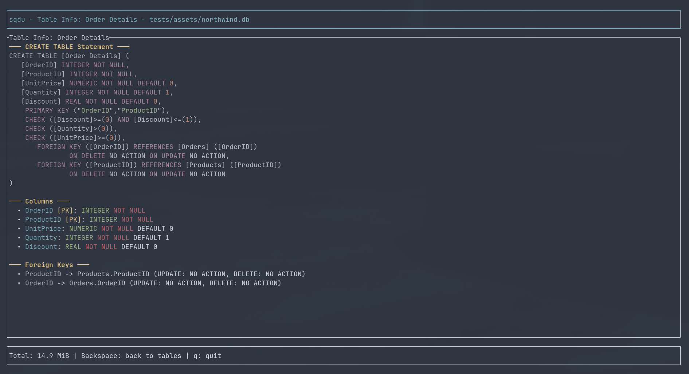

# sqdu - SQLite Disk Usage Analyzer

**NCDU for SQLite databases**

A terminal-based disk usage analyzer for SQLite databases, inspired by [ncdu](https://dev.yorhel.nl/ncdu). Quickly identify which tables and indexes are consuming the most space in your database.



## Features

- **Table Overview** - See all tables sorted by size with row counts and index statistics
- **Index Analysis** - Drill down into individual tables to see index sizes and types
- **Schema Inspector** - View detailed table schemas with syntax-highlighted DDL, columns, foreign keys, and triggers
- **Fast** - Analyzes databases quickly using SQLite's built-in `dbstat` virtual table
- **Intuitive TUI** - Clean, navigable interface with vim-style keybindings

## Screenshots

### Table Overview

See all tables sorted by disk usage with percentages and row counts.

### Index Details

View indexes for a specific table with size breakdown.

### Table Schema

Inspect full table schema with syntax highlighting, columns, foreign keys, and constraints.

## Installation

```bash
cargo install --path .
```

Or build from source:

```bash
git clone https://github.com/isms/sqdu.git
cd sqdu
cargo build --release
./target/release/sqdu your-database.db
# optionally: put somewhere in your PATH, e.g. `cp target/release/sqdu ~/.local/bin/`
```

## Usage

```bash
sqdu <database.db>
```

### Keybindings

#### Table Overview
- Up/Down or `k`/`j` - Navigate tables
- `Enter` - View indexes for selected table
- `i` - View detailed info for selected table
- `q` - Quit

#### Index View
- Up/Down or `k`/`j` - Navigate indexes
- `i` - View table schema and details
- `Backspace` or `h` - Back to table overview
- `q` - Quit

#### Info View
- Up/Down or `k`/`j` - Scroll content
- `Backspace` or `h` - Back to table overview
- `q` - Quit

## How It Works

sqdu uses SQLite's `dbstat` virtual table to accurately measure the disk space used by each table and index. It counts the number of pages used and multiplies by the page size to get the actual bytes on disk.

## Why?

Understanding database disk usage is crucial for:
- Identifying bloated tables that need optimization
- Finding unnecessary or duplicate indexes
- Planning database growth and capacity
- Optimizing query performance by understanding index sizes
